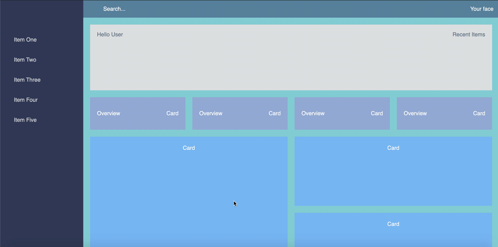
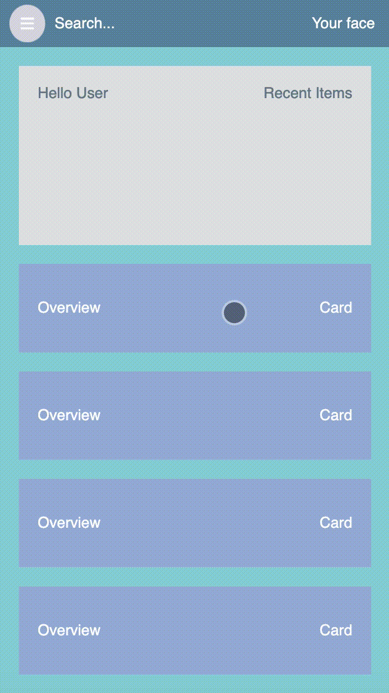

# Responsive Basic Empty Dashboard Layout with Grid and Flexbox

Creating basic dashboard with Vanilla CSS, Javascript, HTML.

Link: https://css-grid-flexbox-responsive-tascigorkem.netlify.app/

#### Web:

  
#### Mobile:

#### Reference: 
Matt Holland - https://medium.com/@mtholland10   
Scott Domes - https://medium.com/@scottdomes

MDN Flexbox: https://developer.mozilla.org/en-US/docs/Learn/CSS/CSS_layout/Flexbox  
MDN Grid: https://developer.mozilla.org/en-US/docs/Learn/CSS/CSS_layout/Grids  
MDN Media Queries: https://developer.mozilla.org/en-US/docs/Web/CSS/Media_Queries/Using_media_queries

CSS Naming Methodology - BEM (Block Element Modifier): https://css-tricks.com/bem-101/
